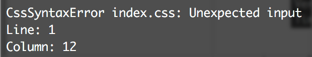

# CSSO Compression Plugin
[![npm][npm]][npm-url]
[![node][node]][node-url]
[![deps][deps]][deps-url]

Plugin good in pair with [ExtractTextPlugin](https://github.com/webpack-contrib/extract-text-webpack-plugin).

**Why is not [csso-loader](https://www.npmjs.com/package/csso-loader) or [postcss-csso](https://github.com/lahmatiy/postcss-csso)?**
 * **[Full](https://rawgithub.com/zoobestik/csso-webpack-plugin/dev/docs/img/better-full.svg) restructuring** in bundles: 
 * No problems with css-modules syntax like `:global(.c .d) .a { color: #fff; }` 

## Install

**Attention! This is alpha version!**
 * **No source maps**
 * **No anything else except basic minify**

```bash
npm i -D csso-webpack-plugin
```

## Usage

```js
const CSSOCompressPlugin = require("csso-webpack-plugin");

module.exports = {
  plugins: [
    new CSSOCompressPlugin(),
  ]
}
```

## Options

```js
new CSSOCompressPlugin([options: CssoOptions], [filter: function | RegExp])
```

Arguments:
* **options** — csso [options](https://github.com/css/csso#minifysource-options). 
* **filter** — Detect should be file processed. *Defaults to ends `".css"`*.

[npm]: https://img.shields.io/npm/v/csso-webpack-plugin.svg
[npm-url]: https://npmjs.com/package/csso-webpack-plugin

[node]: https://img.shields.io/node/v/csso-webpack-plugin.svg
[node-url]: https://nodejs.org

[deps]: https://david-dm.org/zoobestik/csso-webpack-plugin.svg
[deps-url]: https://david-dm.org/zoobestik/csso-webpack-plugin

[tests]: http://img.shields.io/travis/zoobestik/csso-webpack-plugin.svg
[tests-url]: https://travis-ci.org/zoobestik/csso-webpack-plugin

[cover]: https://coveralls.io/repos/github/zoobestik/csso-webpack-plugin/badge.svg
[cover-url]: https://coveralls.io/github/zoobestik/csso-webpack-plugin
